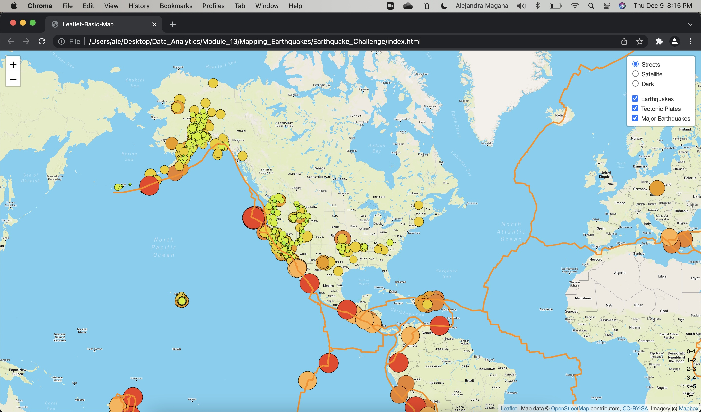
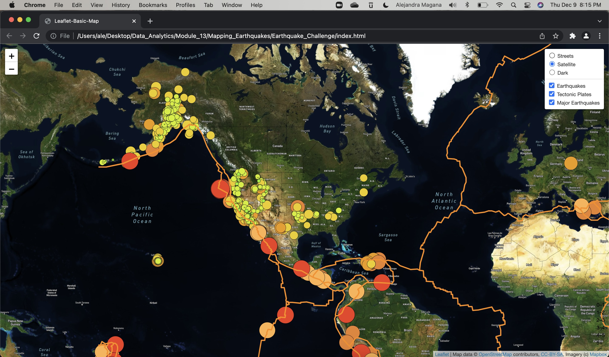
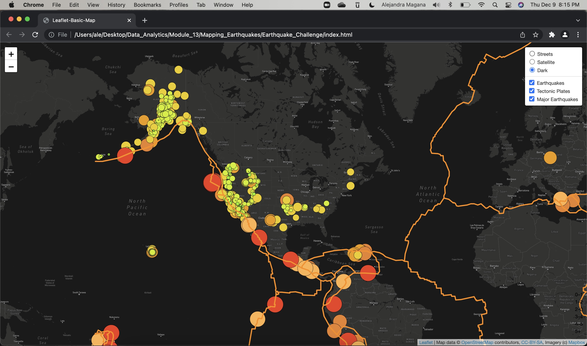

# Mapping Earthquakes

## Project Overview
The purpose of this project was to gather earthquake GeoJSON data from USGS API and create an interactive map that displays earthquakes around the world. Earthquake data is displayed in relation to tectonic plate locations and with a magnitude greater than 4.5.

## Results 
Three Interactive Map Views

- Streets View

- Satellite View

- Dark View

